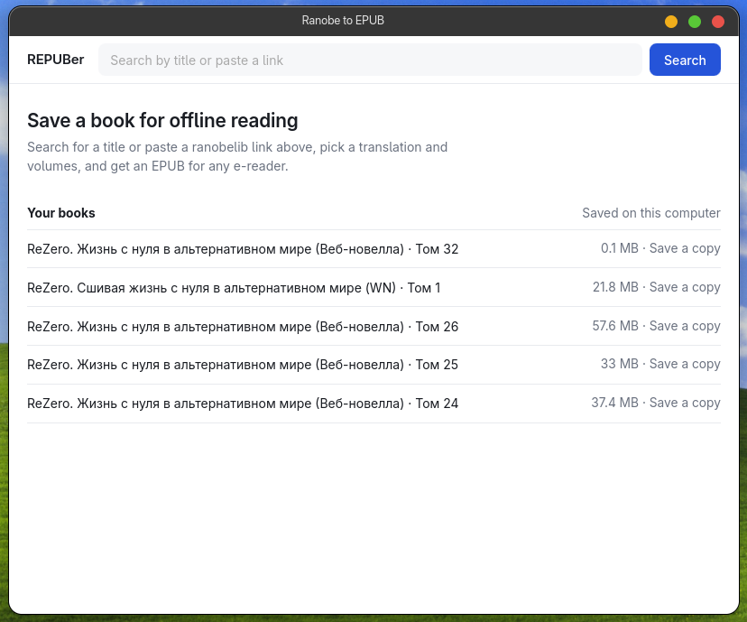
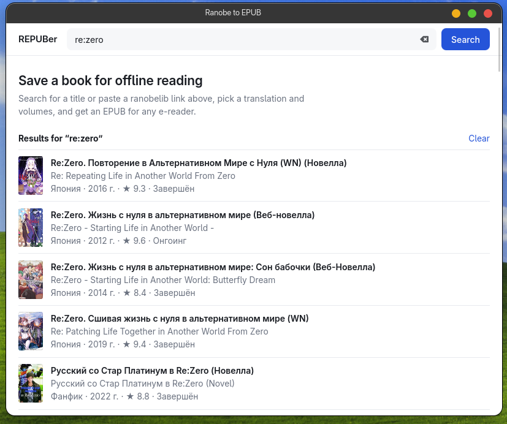
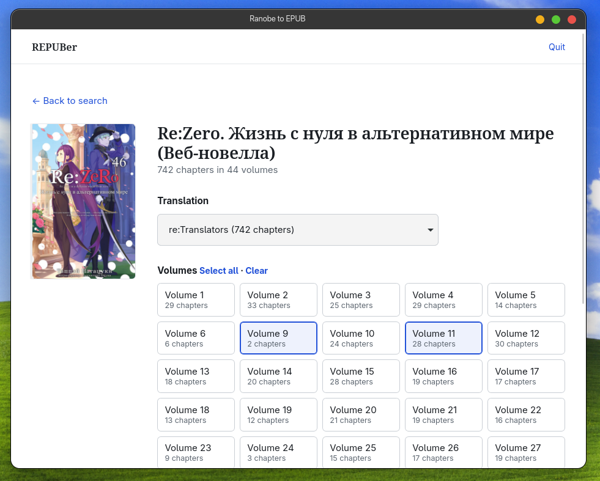
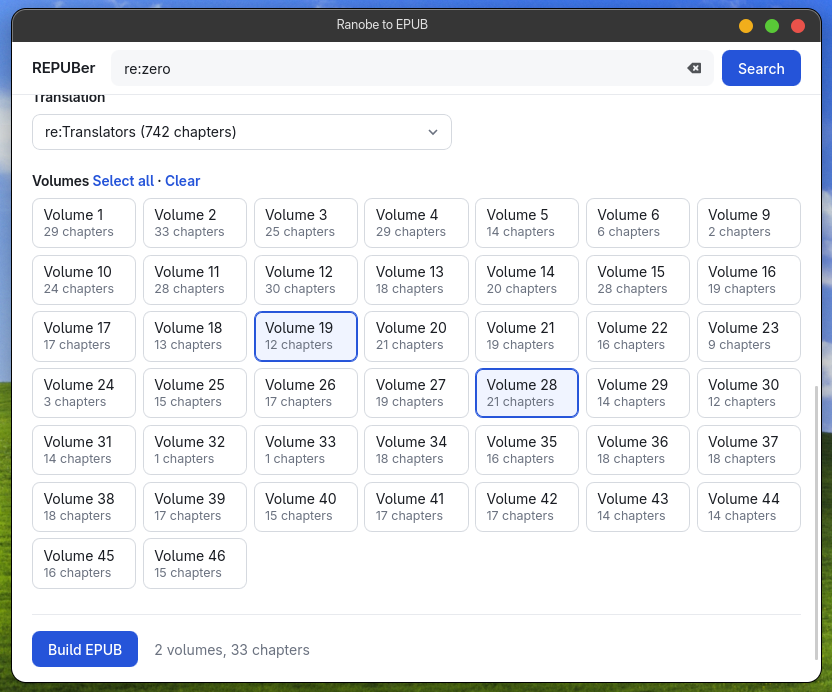

# REPUBer

Приложение для скачивания ранобэ с [ranobelib](https://ranobelib.me) в формате EPUB. Вставьте ссылку, выберите перевод и тома, а потом читайте на любом устройстве без интернета.

   

## Возможности

- Окно на Qt. Работает на Windows, macOS и Linux.
- Выбор перевода (команды переводчиков) и томов: один, несколько или все сразу.
- Поиск нужных ранобэ с детальной информацией.
- Обложка, титульная страница и оглавление, сгруппированное по томам.
- Каждая иллюстрация лежит на отдельной странице и не смешивается с текстом.
- Книга подстраивается под шрифт, размер и тему вашей читалки, включая ночной режим.
- Список скаченных книг внутри приложения.

## Быстрый старт

Нужен Node.js 18 или новее.

```bash
git clone https://github.com/neoslvt/ranobelib-epub.git
cd ranobelib-epub
npm install
npm start
```

Команда откроет окно программы. Вместе с зависимостями ставится qode — среда Node.js, в которой работает NodeGui.

## Как пользоваться

1. Скопируйте ссылку на книгу с ranobelib или только идентификатор вида `12345--nazvanie`.
2. Вставьте её в поле и нажмите **Find book**.
3. Выберите перевод и нужные тома.
4. Нажмите **Build EPUB** и дождитесь окончания. Книга сохранится автоматически.

Все книги сохраняются в папку `RanobeLibrary` в вашей домашней директории (на Windows это `C:\Users\Имя\RanobeLibrary`). Позже их можно сохранить повторно из списка **Your books** на главной странице.

## Имплементированные ядра

| Название | Поиск | Информация | Загрузка |
|---|---|---|---|
| MangaLib | ✅ | ✅ | ✅ |
| RanobeLib | ✅ | ✅ | ✅ |
| MangaHub | ✅ | ✅ | ✅ |
| Yamiko | ✅ | ✅ | ✅ |

## Структура проекта

Окно собрано на NodeGui. Исходники в `src/cores/` написаны на обычном JavaScript: `fetch`, `Uint8Array` и чистые зависимости, без `fs` и других модулей Node. Сохранение файла остаётся снаружи: окно пишет EPUB на диск.

```
ranobelib-epub/
├── app.js                 # запуск окна
├── src/
│   ├── gui.js             # интерфейс на NodeGui
│   ├── actions.js         # поиск, сборка и библиотека
│   ├── server.js          # локальный HTTP API
│   ├── load-cores.js      # дополнительные ядра из папки cores/ (только Node)
│   └── cores/             # ядра источников, совместимые с React Native
├── cores/                 # свои ядра: положите сюда файл .js
├── static/
│   └── index.html         # интерфейс
└── package.json
```

Своё ядро — это файл в `cores/`, который экспортирует экземпляр `CORE`. Он подхватывается при следующем запросе.

```js
import { Core } from "../src/cores/base.js";

class Example extends Core {
  id = "example";
  name = "Example";
  async search() {
    return [];
  }
  async info(query) {
    return { title: query, slug: query, volumes: [], branches: [], chapters: 0 };
  }
  async build() {
    throw new Error("Not implemented");
  }
}

export const CORE = new Example();
```

## Если что-то не работает

| Проблема | Что делать |
|---|---|
| Ошибка 404 при запуске | `index.html` должен лежать в папке `static`. |
| Окно не открылось | Запускайте через `npm start`. Нужны обычные библиотеки рабочего стола (X11 или Wayland). Текст ошибки будет в терминале. |
| «Couldn't find chapters» | Проверьте ссылку и подключение к интернету. |
| Загрузка идёт медленно | Страницы качаются по несколько сразу. На большой главе это всё равно занимает время. |

Приложение использует внутренний API сайта. Если ranobelib его изменит, загрузка может перестать работать до обновления программы.
Если сталкнётесь с иной проблемой или хотите новых фич, создавайте issue, я постараюсь прочитать всё.

## Важно

Проект не связан с ranobelib. Используйте его для личного чтения и уважайте права авторов и переводчиков.

## Послесловие

Мне самому нужен был подобный софт, поскольку читать хочется, а источников для скачивания любимых ранобэ нигде нормально не найти, так что вот так :)
